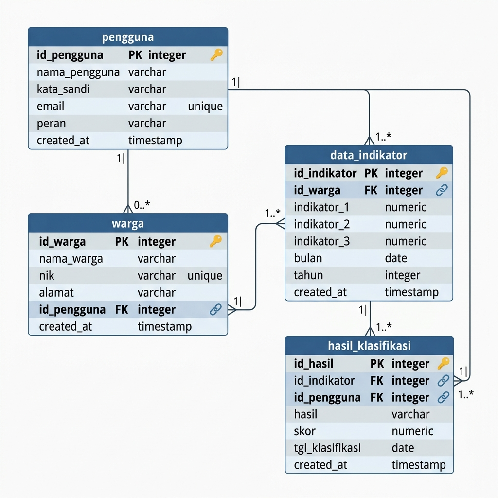
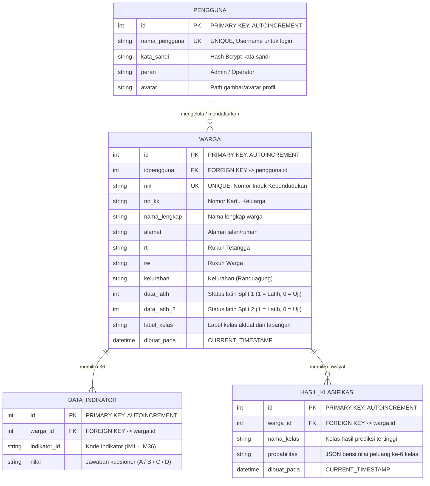

# 📊 DIAGRAM RELASI DATABASE (ENTITY RELATIONSHIP DIAGRAM)
## Sistem Klasifikasi Kesejahteraan Warga - Kelurahan Randuagung

Berikut adalah diagram relasi antar tabel (ERD) untuk database SQLite `data_skripsi.db` yang digunakan dalam aplikasi.

### 1. Visualisasi Gambar ERD

---

### 2. Visualisasi ERD (Mermaid Code)

---

### 3. Penjelasan Relasi Antar Tabel

1. **`pengguna` ke `warga` (One-to-Many / $1 : N$)**:
   - **Kunci Hubung**: `pengguna.id` (PK) berhubungan dengan `warga.idpengguna` (FK).
   - **Penjelasan**: Seorang pengguna (Admin/Operator) dapat mengelola atau mendaftarkan banyak warga, sedangkan satu warga dicatat oleh satu pengguna yang memasukkan datanya.

2. **`warga` ke `data_indikator` (One-to-Many / $1 : N$)**:
   - **Kunci Hubung**: `warga.id` (PK) berhubungan dengan `data_indikator.warga_id` (FK).
   - **Penjelasan**: Satu warga memiliki tepat **36 data indikator** (dari kode `IM1` sampai `IM36`) yang mewakili seluruh jawaban kuesioner mereka.

3. **`warga` ke `hasil_klasifikasi` (One-to-Many / $1 : N$)**:
   - **Kunci Hubung**: `warga.id` (PK) berhubungan dengan `hasil_klasifikasi.warga_id` (FK).
   - **Penjelasan**: Satu warga dapat diklasifikasikan berulang kali (misal jika ada pembaruan jawaban indikator), sehingga memiliki riwayat hasil prediksi klasifikasi.

---

### 💡 Cara Menjelaskan Diagram ini ke Penguji:
- **Tabel Utama**: Jelaskan bahwa data berputar di sekitar tabel **`warga`** yang menyimpan profil kependudukan.
- **Tabel Pendukung**:
  - **`pengguna`** untuk mencatat siapa yang menginput data tersebut (akuntabilitas data).
  - **`data_indikator`** untuk memisahkan 36 pertanyaan kuesioner agar database tetap dinamis dan tidak memiliki 36 kolom jawaban langsung di tabel warga (desain database ternormalisasi).
  - **`hasil_klasifikasi`** untuk menyimpan hasil akhir perhitungan Naive Bayes beserta detail nilai peluang (probabilitas) tiap kelas kesejahteraan warga.
